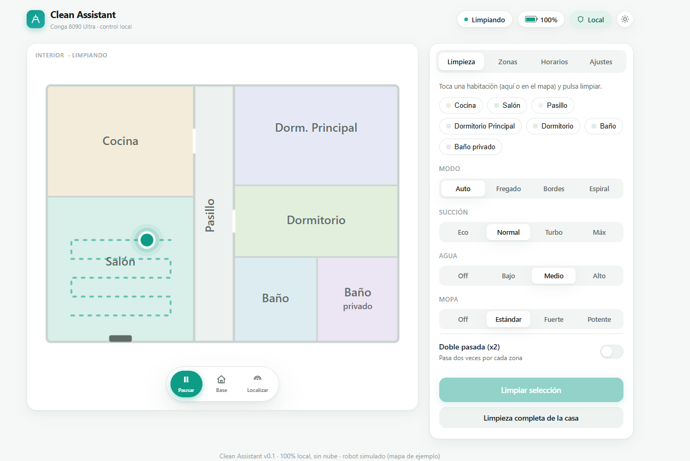

# Clean Assistant

Aplicación **local y sin nube** para gestionar el robot aspirador **Cecotec Conga
8090 Ultra**: mapa, limpieza por habitaciones, zonas, horarios y todos los ajustes,
con una interfaz web propia y bonita. En la línea de Valetudo/Congatudo, pero para
la generación 8000 (que usa TLS + WebSocket + JSON + Protobuf, no soportada por
aquellos proyectos).

> Se apoya en la ingeniería inversa del repo de documentación:
> [conga_8090_mqtt_bridge](https://github.com/miguelsg29/conga_8090_mqtt_bridge).



## Instalación en Home Assistant (rápida)

La forma recomendada de usar Clean Assistant. Se abre desde la barra lateral de HA,
sin login aparte.

1. **Añade este repositorio de add-ons**: en Home Assistant, **Ajustes → Add-ons →
   Tienda de add-ons → menú ⋮ (arriba a la derecha) → Repositorios**, pega
   `https://github.com/miguelsg29/clean-assistant` y pulsa **Añadir**.
2. **Instala "Clean Assistant"** desde la tienda (si no aparece, recarga con ⋮ →
   Recargar) y ábrelo.
3. **Redirige el robot a Home Assistant**: en tu router o servidor DNS, haz que
   `tcp-cecotec.3irobotix.net` apunte a la **IP de Home Assistant** (el robot se
   conecta al puerto **9090** de HA). Luego **reinicia el robot** (corte de luz) para
   que reconecte ahí.
4. **Arranca el add-on.** No hace falta rellenar los IDs del robot: se
   **autoconfiguran** en el primer arranque (captura la identidad de la nube y pasa
   solo a modo local; a partir de ahí funciona sin nube).
5. Abre **Clean Assistant** en la barra lateral: verás el **mapa real** y todos los
   controles. 🎉
6. *(Opcional)* **Entidades en Home Assistant (MQTT):** si tienes el add-on de
   **Mosquitto broker**, rellena en la configuración del add-on `MQTT_HOST`
   (`core-mosquitto`), `MQTT_USER` y `MQTT_PASS`. Aparecerá el dispositivo
   **Conga 8090** con aspiradora, batería, botones por habitación, selectores,
   horarios… Si dejas `MQTT_HOST` vacío y usas el broker estándar de HA, se
   autoconfigura solo.

## Estado: v0.11 — funcional, verificada con robot real ✅

App completa y **verificada de punta a punta con un Conga real**, empaquetada para
**Docker** y como **add-on de Home Assistant** (ingress). Incluye un **robot simulado**
para desarrollar/probar la interfaz sin un Conga:

- ✅ `conga_core`: constructores de todos los comandos confirmados, modelo de estado
  y mapa (de ejemplo).
- ✅ Backend **FastAPI**: API REST + WebSocket en vivo + sirve el frontend.
- ✅ Frontend cableado en vivo: mapa, selección de habitaciones, dock de control
  (iniciar/pausar/base/localizar), modos, succión/agua/mopa, y ajustes (voz, no
  molestar, OTA, vaciar base…).
- ✅ **Robot real** (`RealRobot`): servidor TLS+WS que suplanta la nube, login con
  JWT sintético, report_data → estado, envío de comandos. Misma interfaz que el mock;
  verificado de punta a punta con un robot simulado.
- ✅ **Mapa real**: decodificador zlib+Protobuf (`decode_map`), recepción en `RealRobot`
  (frame `syn_no_cache`) y **render en canvas** con las habitaciones y selección tocando
  el mapa. Verificado con un frame de mapa real capturado (8 habitaciones, 13 ms).
- ✅ **Transformación rejilla↔metros** (origen −20/−20 m, 0.05 m/celda) validada contra
  zonas reales capturadas, y **posición del robot** dibujada sobre el mapa real.
- ✅ **Zonas** (prohibida / sin fregona / limpieza): se dibujan como rectángulos sobre
  el mapa, se convierten a metros y se envían con `set_virwall`/`set_area`; persistentes
  (`zones.json`), con lista y borrado. Flujo completo verificado por la API.
- ✅ **Horarios** (`setOrder6090`): editor visual (nombre, hora, días, habitaciones y
  modo), con lista, activar/desactivar y borrar; persistentes (`schedules.json`).
- ✅ **Posición del robot en vivo**: la pose se separa de la rejilla (solo se reenvía el
  mapa completo cuando la rejilla cambia; si solo se mueve el robot va un push ligero de
  `pose`) y se dibuja en una **capa superpuesta** con desplazamiento animado y anillo
  pulsante mientras limpia.
- ✅ **Puente MQTT** para Home Assistant (`backend/mqtt_bridge.py`): montado **encima**
  del mismo `RealRobot` (sin un segundo servidor 9090), publica autodiscovery (vacuum,
  batería/área/tiempo, consumibles, botones por habitación, selectores potencia/agua/mopa/
  modo/base, switches no molestar/voz/OTA/turbo/x2, volumen y horarios) y traduce los
  comandos de HA a `robot.command(...)`. Se activa solo con `MQTT_HOST`. Verificado con un
  cliente MQTT simulado (discovery + estado + comandos).
- ⬜ Modo por habitación en el editor de horarios.

## Arquitectura

```
   Conga 8090
       │  (DNS: tcp-cecotec → este servidor)
       ▼
┌──────────────────────────────────────────────┐
│           Clean Assistant (backend)            │
│   conga_core   → protocolo + estado + mapa     │
│   backend/app  → FastAPI: REST + WebSocket     │
│                  sirve el frontend estático    │
└───────────────────────┬────────────────────────┘
                        ▼
              Navegador / móvil (interfaz web)
```

En v0.1, `backend/app.py` usa `MockRobot`. El robot real implementará la misma
interfaz (`.state`, `command(control)`, `tick()`) y se enchufará en el mismo sitio.

## Puesta en marcha

```bash
pip install -r requirements.txt
uvicorn backend.app:app --reload --port 8000
```

Abre **http://localhost:8000**. Verás la interfaz con el robot simulado: pulsa
*Iniciar* y observa cómo cambia el estado en vivo (por WebSocket).

### Modo real (contra tu Conga)

1. Copia `.env.example` a `.env` y pon `CONGA_MODE=real`. **No hace falta rellenar los
   IDs del robot**: se autocapturan en el primer arranque (ver abajo).
2. Redirige el DNS de `tcp-cecotec.3irobotix.net` a la IP de esta máquina y abre el
   puerto 9090. Los certificados se generan solos (openssl) si no existen.
3. Arranca (`uvicorn backend.app:app`) y reinicia el robot (corte de luz). En el log
   verás `[robot] conectado` y el estado real en la interfaz.

**Autoconfiguración (primer arranque):** si no has puesto los IDs, Clean Assistant
arranca en modo **pasarela a la nube**, captura la identidad del robot (DID, userid,
SN, MAC…) de la respuesta de login, la guarda en `identity.json` y **pasa solo a modo
local**. A partir de ahí funciona sin nube. También puedes elegir el modo a mano en
**Ajustes → Modo de funcionamiento** (Local / Cloud + Local).

### Home Assistant (puente MQTT, opcional)

Clean Assistant puede publicarse en HA **además** de la web, con una sola conexión al
robot. Solo tienes que definir el broker en `.env`:

```
MQTT_HOST=192.168.1.10
MQTT_PORT=1883
MQTT_USER=usuario
MQTT_PASS=clave
```

Al arrancar aparecerá el dispositivo **Conga 8090** en HA (autodiscovery): aspiradora,
batería/área/tiempo, consumibles, un botón por habitación, selectores de potencia/agua/
mopa/modo/base, switches de no molestar/voz/OTA/turbo/doble pasada, volumen y un switch
por horario. La disponibilidad sigue a la conexión del robot.

> ⚠️ Esto **sustituye** al puente clásico `conga_mqtt_bridge.py`: ambos escuchan en el
> 9090, así que no ejecutes los dos apuntando al mismo robot a la vez.

## Docker

```bash
cp .env.example .env          # pon CONGA_MODE=real y los IDs de tu robot
docker compose up -d --build
```

La web queda en `http://este-host:8000` y el servidor del robot en el `:9090`. Los
certificados, el mapa, las zonas, los horarios y la vista se guardan en `./data`
(persistente). También puedes construir la imagen a mano con el `Dockerfile`.

## Add-on de Home Assistant (ingress)

Este repositorio **es también un repositorio de add-ons de Home Assistant**. En HA:
**Ajustes → Add-ons → Tienda de add-ons → ⋮ → Repositorios**, añade
`https://github.com/miguelsg29/clean-assistant` e instala **Clean Assistant**.

- La interfaz se abre **desde la barra lateral de HA** (ingress, con la sesión de HA;
  sin login aparte).
- El robot se conecta al **puerto 9090** del host de HA (redirige ahí el DNS de
  `tcp-cecotec.3irobotix.net` y reinicia el robot).
- Los datos del robot se **autocapturan** en el primer arranque (puedes dejarlos a 0).
- **MQTT automático**: si tienes el add-on de Mosquitto (u otro broker) en HA, el
  add-on coge host/usuario/contraseña **solos**, sin rellenar nada. Solo tienes que
  poner los campos `MQTT_*` a mano si usas un broker externo a Home Assistant.
- El add-on `clean_assistant/` instala la app desde este repo (sin duplicar código);
  para fijar versión, pon `CA_REF` a un tag de release en su `Dockerfile`.

## Estructura

```
clean-assistant/
├── conga_core/          # núcleo del protocolo (fuente de la verdad, compartible)
│   ├── commands.py      # constructores de comandos (set_mode, set_preference, …)
│   ├── state.py         # RobotState desde report_data
│   └── map.py           # mapa estructurado (de ejemplo; luego el real)
├── backend/
│   ├── app.py           # FastAPI: REST + WebSocket + estáticos
│   ├── mock.py          # robot simulado
│   ├── zones.py         # zonas (virwall/area) persistentes
│   ├── schedules.py     # horarios (setOrder6090) persistentes
│   ├── mqtt_bridge.py   # puente Home Assistant (autodiscovery), opcional
│   └── static/          # frontend (index.html)
├── requirements.txt
├── Dockerfile           # imagen Docker independiente
├── docker-compose.yml   # despliegue con Compose
├── repository.yaml      # este repo como repositorio de add-ons de HA
└── clean_assistant/     # add-on de Home Assistant (ingress)
    ├── config.yaml
    ├── Dockerfile
    └── run.sh
```

## Hoja de ruta

1. ✅ **Robot real**: servidor TLS+WebSocket (del puente) como `RealRobot`.
2. ✅ **Mapa real**: decodificador zlib+Protobuf → datos en vivo (+ posición del robot).
3. ✅ **Zonas**: prohibidas / sin fregona / de limpieza sobre el mapa.
4. ✅ **Horarios** visuales (`setOrder6090`).
5. ✅ **MQTT** opcional para Home Assistant.
6. ✅ **Empaquetado**: Docker (`Dockerfile` + `docker-compose.yml`) y add-on de
   Home Assistant con ingress (`repository.yaml` + `clean_assistant/`).
