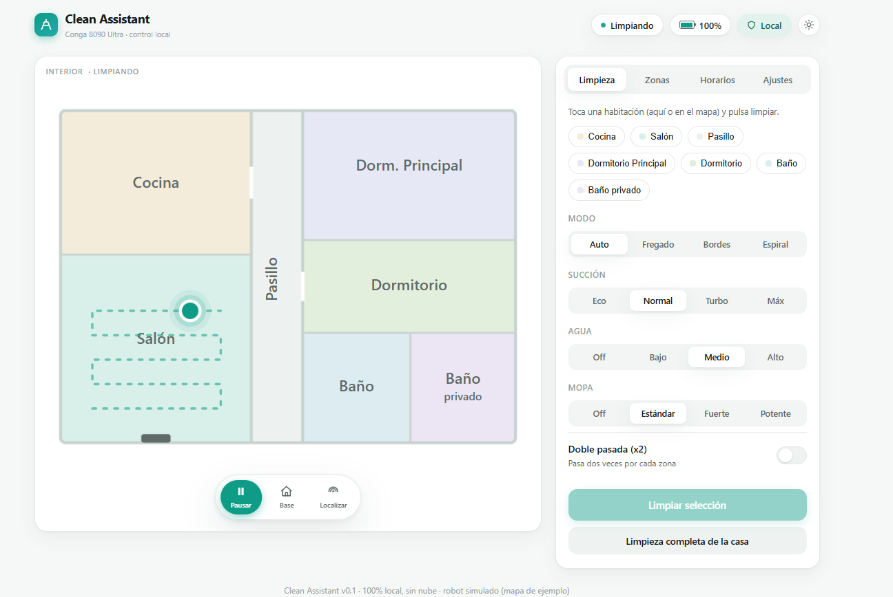

# Clean Assistant

Aplicación **local y sin nube** para gestionar el robot aspirador **Cecotec Conga
8090 Ultra**: mapa en vivo, limpieza por habitaciones, zonas, horarios, historial y
todos los ajustes, con una interfaz web propia y bonita. En la línea de
Valetudo/Congatudo, pero para la generación 8000 (que usa TLS + WebSocket + JSON +
Protobuf, no soportada por aquellos proyectos).

> Se apoya en la ingeniería inversa del repo de documentación:
> [conga_8090_mqtt_bridge](https://github.com/miguelsg29/conga_8090_mqtt_bridge).



## 🔌 100% local — independiente de la nube de Cecotec

Este es el objetivo del proyecto: **tu robot sigue funcionando aunque Cecotec apague
sus servidores.** Clean Assistant suplanta **todos** los servicios que el robot busca
en internet, redirigiéndolos por DNS a tu servidor:

- **Control** (puerto 9090, WSS): órdenes, mapa, estado, zonas y horarios.
- **OTA** (puerto 8001): al arrancar, el robot pregunta «¿hay firmware nuevo y dónde
  están los servicios?». Clean Assistant responde «sin actualización» y le da un
  directorio que apunta a sí mismo. Es la pieza **clave** del arranque: sin ella el
  robot no sabe a dónde conectar. (Además, las actualizaciones automáticas quedan
  **desactivadas por defecto**, así el robot no descarga firmware por su cuenta.)
- **Historial** (puertos 8002/8006): el robot sube un informe por cada limpieza;
  Clean Assistant los acepta y los vuelca a su **historial** (fecha, hora, m², duración).

Y lo mejor: **no necesitas la nube ni siquiera la primera vez.** En una instalación
nueva, Clean Assistant **aprende la identidad del propio robot** (número de serie,
modelo, identificador…) de las peticiones que este hace nada más arrancar, obtiene la
MAC de la red y se autoconfigura sola. También puedes exportar esa identidad como
**«llave de recuperación»** para restaurarla en otro servidor.

## Instalación en Home Assistant (rápida)

La forma recomendada de usar Clean Assistant. Se abre desde la barra lateral de HA,
sin login aparte.

> Desde **Home Assistant 2026.2**, los «Add-ons» se llaman ahora **«Apps»**. Uso el
> término nuevo; si tu Home Assistant es anterior, es exactamente lo mismo que «Add-ons».

1. **Añade este repositorio** a tu Home Assistant. Un clic:

   [](https://my.home-assistant.io/redirect/supervisor_add_addon_repository/?repository_url=https%3A%2F%2Fgithub.com%2Fmiguelsg29%2Fclean-assistant)

   O a mano: en Home Assistant, **Ajustes → Apps → Tienda de Apps → menú ⋮ (arriba a la
   derecha) → Repositorios**, pega `https://github.com/miguelsg29/clean-assistant` y pulsa
   **Añadir**.
2. **Instala «Clean Assistant»** desde la Tienda de Apps (si no aparece, recarga con ⋮ →
   Recargar) y ábrelo.
3. **Redirige el robot a Home Assistant** con un servidor DNS (AdGuard Home, Pi-hole o
   tu router). Para independencia total, haz que **todos** estos dominios apunten a la
   **IP de Home Assistant**:
   ```
   tcp-cecotec.3irobotix.net     (control)
   cecotec-ota.3irobotix.net     (OTA)
   eu-ota.3irobotix.net          (OTA)
   web-eu.3irobotix.net          (historial)
   web-cecotec.3irobotix.net     (historial)
   ```
   Luego **reinicia el robot** (corte de luz) para que reconecte ahí. *(El asistente de
   primer arranque te muestra estas instrucciones con la IP ya detectada y un indicador
   en vivo de si el robot conecta.)*
4. **Arranca la app.** No hace falta rellenar los IDs del robot: se
   **autoconfiguran** solos aprendiendo la identidad del propio robot.
5. Abre **Clean Assistant** en la barra lateral: verás el **mapa real** y todos los
   controles. 🎉
6. *(Opcional)* **Entidades en Home Assistant (MQTT):** si tienes la app de
   **Mosquitto broker**, Clean Assistant coge host/usuario/contraseña **solos**. Aparecerá el
   dispositivo **Conga 8090** con aspiradora, batería, botones por habitación,
   selectores, horarios… Solo rellena los campos `MQTT_*` a mano si usas un broker
   externo a Home Assistant.

## Qué ofrece

App completa y **verificada de punta a punta con un Conga 8090 real**, empaquetada para
**Docker** y como **app de Home Assistant** (add-on/ingress). Incluye un **robot simulado**
para desarrollar la interfaz sin un Conga.

### 🗺️ Mapa en vivo
- Mapa real del robot decodificado (zlib + Protobuf) y dibujado en canvas, con las
  **habitaciones**, sus nombres y la **posición del robot** en tiempo real (capa
  superpuesta con desplazamiento animado y anillo pulsante mientras limpia).
- **Zoom y desplazamiento**: rueda del ratón, pellizco (pinch) y arrastre en el móvil,
  doble toque para acercar, y botones +/−/ajustar.
- **Girar y reflejar** el mapa para alinearlo con tu casa (el espejo viene activado por
  defecto). Cabecera con nombre del mapa, estado y m²/tiempo de la última limpieza.

### 🧹 Limpieza y control
- Iniciar, pausar, reanudar, volver a la base, localizar.
- Limpiar **habitaciones sueltas** (tócalas en el mapa) o limpieza completa.
- Ajustes: **succión, agua y mopa**, modo (auto/fregado/bordes/espiral), doble pasada,
  alfombra (carpet turbo), tipo de base, **frecuencia de vaciado** del colector, voz y
  volumen, **no molestar**, y actualizaciones automáticas (OTA).
- **Consumibles**: vida restante de cepillos, filtro y mopa, con botón para poner a cero
  al cambiar la pieza.
- Avisos y errores del robot en la cabecera (p. ej. «Depósito de agua bajo»).

### 🚪 Habitaciones
- Nombre, **tipo de estancia** (con icono) y **tipo de suelo** (madera, azulejos,
  alfombra, suave) por habitación, dibujado en el mapa con textura.
- **Unir** y **separar** habitaciones directamente sobre el mapa.
- **Metros cuadrados** por habitación y total de la casa.

### 🚫 Zonas
- **Prohibidas**, **sin fregona** y de **doble pasada (x2)**: se dibujan como
  rectángulos sobre el mapa, se mueven/redimensionan y se envían al robot
  (`set_virwall`/`set_area`). Persistentes y **por mapa**.
- Adopta automáticamente las zonas creadas en la app oficial de Cecotec.
- Se reenvían al robot si este las pierde tras un reinicio (sin acumularlas si controlas
  el robot desde dos servidores).

### ⏰ Horarios
- Editor visual: nombre, hora, días, **habitaciones y modo por habitación**
  (`setOrder6090`). Activar/desactivar, editar y borrar. Persistentes y **por mapa**.
- Se sincronizan en ambos sentidos con el robot (importa los que falten, incluidos los
  de la app oficial; sube los de Clean Assistant).
- El robot se pone en hora al conectar (`set_time`) para que **disparen a la hora
  correcta** aunque lleve tiempo sin nube (con zona horaria de Home Assistant).

### 🏠 Mapas de la casa
- Listar, **cambiar**, renombrar, **crear** (remapea la casa) y **borrar** mapas —
  también el activo o el último (el robot se queda sin mapa para empezar de cero).
- Al crear el **primer** mapa se borran los anteriores del robot, evitando los **mapas
  duplicados/fantasma** que el Conga acumulaba con cada mapeo.
- Zonas y horarios se asignan al **mapa correcto** al cambiar.

### 📊 Historial de limpiezas
- Pestaña **Actividad**: cada limpieza (tipo manual/programada, habitaciones, m²,
  duración, día y hora) y los avisos/errores del robot.
- Se nutre también de los **informes que el robot sube** (ingeridos sin nube).

### 🔐 Independencia de la nube y copia de seguridad
- Suplantación de **control + OTA + historial** para funcionar 100% local (ver arriba).
- **Auto-provisión local** de la identidad del robot (sin nube ni datos guardados).
- **Copia de seguridad**: exporta/importa por un lado la **configuración** (mapas,
  zonas, horarios) y por otro la **identidad del robot** («llave de recuperación») para
  mover o restaurar en otro servidor.

### 📱 Home Assistant y móvil
- **Puente MQTT** (autodiscovery): dispositivo **Conga 8090** con aspiradora,
  batería/área/tiempo, consumibles, botón por habitación, selectores de
  potencia/agua/mopa/modo/base, switches de no molestar/voz/OTA/turbo/doble pasada,
  volumen, sensor «Falta agua» y un switch por horario. Montado **encima** del mismo
  robot (sin un segundo servidor). Se activa solo con el broker de HA.
- Interfaz **táctil**: dibujar zonas, separar/unir habitaciones y seleccionar
  habitaciones a dedo, sin que la página haga scroll.

## Arquitectura

```
   Conga 8090 Ultra
       │  (DNS: dominios de Cecotec → este servidor)
       ▼
┌───────────────────────────────────────────────────────┐
│                Clean Assistant (backend)               │
│   RealRobot   → control TLS+WebSocket (9090)           │
│   cloud_stub  → OTA (8001) + historial (8002/8006)     │
│   conga_core  → protocolo + estado + mapa (Protobuf)   │
│   backend/app → FastAPI: REST + WebSocket + estáticos  │
│                 + puente MQTT opcional para HA         │
└───────────────────────────┬───────────────────────────┘
                            ▼
              Navegador / móvil  ·  Home Assistant (MQTT)
```

El robot conecta a Clean Assistant creyendo que es la nube de Cecotec. `RealRobot`
termina el TLS 1.2, hace el handshake WebSocket y responde login (JWT sintético),
heart-beat y report_data; `cloud_stub` responde OTA e historial. La interfaz web y el
puente MQTT se montan sobre el mismo robot. Hay un `MockRobot` con la misma interfaz
(`.state`, `command(control)`, `tick()`) para desarrollar sin un Conga.

## Puesta en marcha (desarrollo)

```bash
pip install -r requirements.txt
uvicorn backend.app:app --reload --port 8000   # robot simulado (CONGA_MODE por defecto)
```

Abre **http://localhost:8000**: pulsa *Iniciar* y observa el estado en vivo (WebSocket).

### Modo real (contra tu Conga)

1. Copia `.env.example` a `.env` y pon `CONGA_MODE=real`. **No hace falta rellenar los
   IDs del robot**: se autoconfiguran solos (ver abajo).
2. Redirige por DNS los dominios de Cecotec (los de la instalación en HA) a la IP de
   esta máquina y abre los puertos **9090, 8001, 8002 y 8006**. Los certificados se
   generan solos (openssl, con el SAN de todos los dominios) si no existen.
3. Arranca (`uvicorn backend.app:app`) y reinicia el robot (corte de luz). En el log
   verás `[robot] LOGIN` y el estado real en la interfaz.

**Autoconfiguración (primer arranque).** Clean Assistant obtiene la identidad del robot
en este orden, sin que tengas que meter nada:

1. **Local, del propio robot** (preferente, sin nube): aprende DID, número de serie y
   modelo de las peticiones que el robot hace (OTA/historial), la MAC de la tabla ARP, y
   acuña el identificador de cuenta. Se guarda en `identity.json`.
2. **Pasarela a la nube** (reserva): si solo rediriges `tcp-cecotec`, captura la
   identidad de la respuesta de login de la nube real y pasa a local.
3. **Manual / llave de recuperación**: rellena los IDs a mano o importa una identidad
   exportada.

Puedes elegir el modo en **Ajustes → Modo de funcionamiento** (Local / Cloud + Local).

## Docker

```bash
cp .env.example .env          # pon CONGA_MODE=real
docker compose up -d --build
```

La web queda en `http://este-host:8000` y los servidores del robot en `:9090` (control)
y `:8001/:8002/:8006` (OTA/historial). Los certificados, mapas, zonas, horarios,
historial, identidad y vista se guardan en `./data` (persistente).

## App de Home Assistant (ingress)

Este repositorio **es también un repositorio de Apps de Home Assistant** (add-ons; ver
«Instalación en Home Assistant»). La interfaz se abre desde la barra lateral (ingress,
con la sesión de HA). La app lee del Supervisor la **zona horaria** y la **IP LAN**
del host (para las instrucciones de DNS), coge el broker **MQTT** de HA solo, y abre los
puertos del robot (9090/8001/8002/8006). Instala la app desde este repo sin duplicar
código; para fijar versión, pon `CA_REF` a un tag de release en su `Dockerfile`.

## Estructura

```
clean-assistant/
├── conga_core/           # núcleo del protocolo (fuente de la verdad, compartible)
│   ├── commands.py       # constructores de comandos (set_mode, setOrder6090, …)
│   ├── state.py          # RobotState desde report_data
│   ├── map.py            # decodificador de mapa (zlib + Protobuf)
│   ├── robot.py          # RealRobot: servidor TLS+WebSocket de control (9090)
│   ├── ws.py             # utilidades WebSocket (handshake, frames)
│   └── config.py         # identidad del robot + JWT sintético
├── backend/
│   ├── app.py            # FastAPI: REST + WebSocket + estáticos + orquestación
│   ├── cloud_stub.py     # suplanta OTA (8001) e historial (8002/8006); auto-provisión
│   ├── maps.py           # gestión de mapas de la casa
│   ├── zones.py          # zonas (virwall/area) persistentes
│   ├── schedules.py      # horarios (setOrder6090) persistentes
│   ├── history.py        # historial de limpiezas
│   ├── mqtt_bridge.py    # puente Home Assistant (autodiscovery), opcional
│   ├── mock.py           # robot simulado
│   └── static/           # frontend (index.html)
├── requirements.txt
├── Dockerfile            # imagen Docker independiente
├── docker-compose.yml    # despliegue con Compose
├── repository.yaml       # este repo como repositorio de Apps de HA (add-ons)
└── clean_assistant/      # app de Home Assistant (add-on/ingress)
    ├── config.yaml
    ├── CHANGELOG.md       # novedades de cada versión
    ├── Dockerfile
    └── run.sh
```

## Estado

**Funcional y verificada de punta a punta con un Conga 8090 Ultra real.** El robot
funciona **100% en local** (control + OTA + historial suplantados) y se **autoconfigura
sin nube** desde el primer arranque. Consulta [`clean_assistant/CHANGELOG.md`](clean_assistant/CHANGELOG.md)
para las novedades de cada versión.
